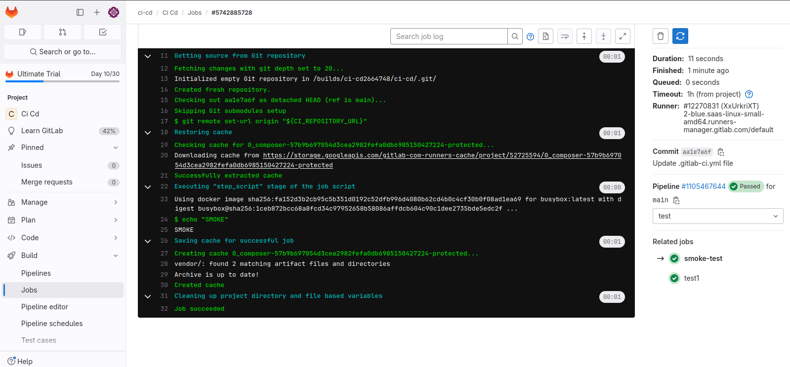

Создал файл с тестовой job в локальном репозитории. Создал новый проект и в нем файл с еще одной тестовой job.
remote.smoke.gitlab-ci.yml
remote-smoke-test:
   script:
    -echo "REMOTE SMOKE"
Указал в pipeline первого проекта include.

Результат локальной тестовой job.

Результат удаленной тестовой job.
